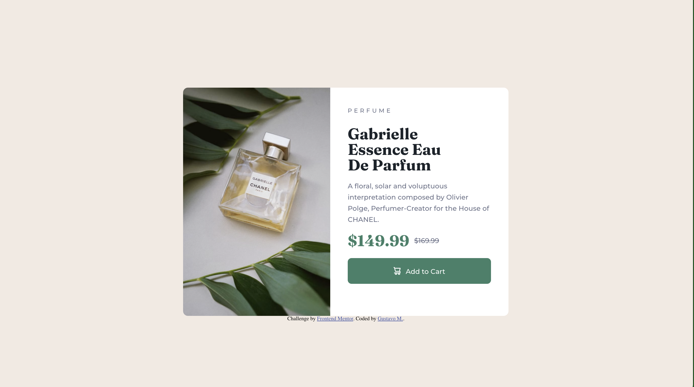

# Frontend Mentor - Product preview card component solution

This is a solution to the [Product preview card component challenge on Frontend Mentor](https://www.frontendmentor.io/challenges/product-preview-card-component-GO7UmttRfa). Frontend Mentor challenges help you improve your coding skills by building realistic projects.

### The challenge

Users should be able to:

- View the optimal layout depending on their device's screen size
- See hover and focus states for interactive elements

### Links

- [Solution URL](https://your-solution-url.com)
- [Live Site URL](https://gsscruz.github.io/frontendmentor/)

### Built with

- Mobile-first
- Semantic HTML5 markup
- Flexbox
- SCSS

### Result - desktop

### Result - mobile

