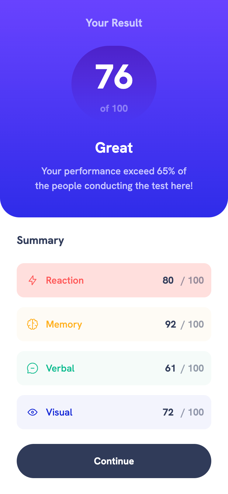
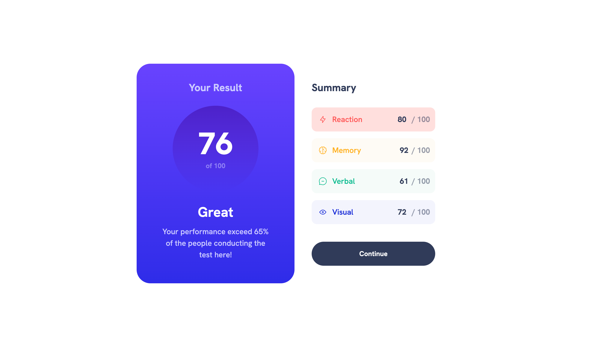

# Frontend Mentor - Componente "Resumo de resultados"

> Resolução do desafio [Results summary component challenge on Frontend Mentor](https://www.frontendmentor.io/challenges/results-summary-component-CE_K6s0maV).

# Screenshot

## **Mobile**

## **Desktop**

### **Links**

- URL: [Add live site URL here](https://your-live-site-url.com)

### **Utilizado**

- HTML5
- TailwindCSS
- Flexbox
- Mobile-first workflow

### **Recursos utilizados**

- [Tailwind Docs](https://tailwindcss.com)
- [SO](https://stackoverflow.com)
- [CSS-Tricks](https://css-tricks.com)
- [Gerador de gradient](https://cssgradient.io)

### **Autor**

- Demais desafios realizados na plataforma - [Demais trabalhos](https://www.frontendmentor.io/profile/gsscruz)
